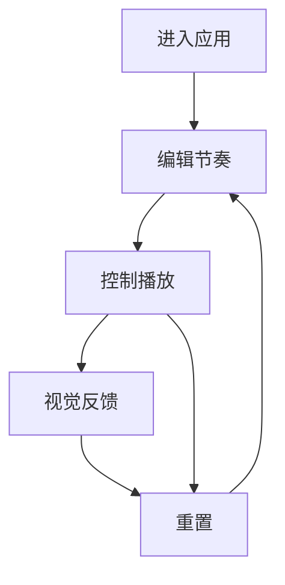

# 律动课堂 - 产品需求文档 (PRD)

## 1. 产品概览
律动课堂是一款面向音乐初学者、教育工作者及节奏爱好者的Web端节奏训练工具，通过可视化的卡片编辑器和智能的播放演示，帮助用户理解和创作节奏型，降低音乐学习门槛。

## 2. 核心业务流程
用户使用律动课堂的典型流程如下：

1. **进入应用**：加载默认节奏型，准备开始使用
2. **编辑节奏**：通过点击节拍点调整节奏型
3. **控制播放**：启动/暂停播放，调节速度和音量
4. **视觉反馈**：观看自动滚动和高亮的视觉演示
5. **重置**：恢复默认状态，开始新的创作



## 3. 用户故事 (User Stories)

### US-01: 节奏编辑
**作为** 音乐初学者  
**我希望** 通过点击节拍点来编辑节奏型  
**以便** 直观地创建和修改节奏，无需专业音乐知识

**业务规则与逻辑**：
- 每个小节有4个节拍点，共4个小节
- 点击节拍点在"休息"、"拍手"、"拍桌"之间循环切换
- 切换时，节拍点的文字和背景色立即更新

**UI/UX 需求**：
- 小节卡横向排列，每个卡片内部是4列网格
- 节拍点有足够大的点击区域
- 不同状态有明显的视觉区分（休息：无背景色；拍手：浅蓝色；拍桌：浅绿色）

**验收标准**：
- 点击任意节拍点，状态正确切换
- 视觉反馈实时更新
- 编辑操作流畅无卡顿

**技术实现**：
- 组件：`Beat` 组件处理单个节拍点的状态和点击事件
- 状态管理：使用 React Context 或 Vuex 管理全局节奏数据

### US-02: 播放控制
**作为** 音乐教师  
**我希望** 控制节奏的播放、速度和音量  
**以便** 在课堂上向学生演示不同的节奏型，并根据教学进度调整速度

**业务规则与逻辑**：
- 点击控制区域在"等待"、"播放"、"暂停"状态之间切换
- 点击"Slow"按钮，BPM减少5（最低40）
- 点击"Fast"按钮，BPM增加5（最高208）
- 点击"Mute"按钮切换静音状态
- 点击"Reset"按钮恢复默认状态并停止播放

**UI/UX 需求**：
- 控制区固定在屏幕底部，便于移动端操作
- BPM值大号显示，按钮标签清晰可辨
- 状态指示器明确显示当前播放状态

**验收标准**：
- 播放/暂停功能正常
- BPM调节范围正确
- 静音功能有效
- 重置功能恢复默认状态

**技术实现**：
- 组件：`ControlPanel` 组件处理控制逻辑
- 定时器：使用 `setInterval` 驱动播放，根据 BPM 计算间隔
- 音频：使用 Web Audio API 或音频文件播放声音

### US-03: 视觉演示
**作为** 节奏爱好者  
**我希望** 在播放时看到视觉引导  
**以便** 更好地跟随节奏，理解节奏型的结构

**业务规则与逻辑**：
- 播放时，当前节拍点高亮显示
- 界面自动滚动，使当前播放的小节保持在视野中央
- 播放头按 BPM 在16个节拍点上依次移动，循环播放

**UI/UX 需求**：
- 高亮效果明显（如深灰色或蓝色边框）
- 滚动平滑，无卡顿
- 视觉反馈与声音同步

**验收标准**：
- 播放时节拍点正确高亮
- 界面自动滚动到当前播放的小节
- 视觉反馈与声音同步

**技术实现**：
- 使用 `scrollIntoView()` 方法实现平滑滚动
- 计算当前播放索引，更新高亮状态

## 4. 视觉线框图 (ASCII)

### 主界面布局
```
+----------------------------------------------------------------------------------------+
|                                          律动课堂                                         |
+----------------------------------------------------------------------------------------+
|                                                                                        |
|  +----------------+  +----------------+  +----------------+  +----------------+        |
|  |     M.1        |  |     M.2        |  |     M.3        |  |     M.4        |        |
|  +----------------+  +----------------+  +----------------+  +----------------+        |
|  | [休息] [拍手]  |  | [休息] [休息]  |  | [休息] [休息]  |  | [休息] [休息]  |        |
|  | [拍手] [休息]  |  | [休息] [休息]  |  | [休息] [休息]  |  | [休息] [休息]  |        |
|  +----------------+  +----------------+  +----------------+  +----------------+        |
|                                                                                        |
+----------------------------------------------------------------------------------------+
|                                                                                        |
|  +------------------------------------------------------------------------------------+ |
|  |  State: WAIT                     BPM: 100                        |                  | |
|  |                                                                 |                  | |
|  |  [Slow]               [Fast]                                    |  [Mute] [Reset]  | |
|  +------------------------------------------------------------------------------------+ |
+----------------------------------------------------------------------------------------+
```

### 播放状态
```
+----------------------------------------------------------------------------------------+
|                                          律动课堂                                         |
+----------------------------------------------------------------------------------------+
|                                                                                        |
|  +----------------+  +----------------+  +----------------+  +----------------+        |
|  |     M.1        |  |     M.2        |  |     M.3        |  |     M.4        |        |
|  +----------------+  +----------------+  +----------------+  +----------------+        |
|  | [休息] [拍手]  |  | [休息] [休息]  |  | [休息] [休息]  |  | [休息] [休息]  |        |
|  | [拍手] [休息]  |  | [休息] [休息]  |  | [休息] [休息]  |  | [休息] [休息]  |        |
|  +----------------+  +----------------+  +----------------+  +----------------+        |
|                                                                                        |
+----------------------------------------------------------------------------------------+
|                                                                                        |
|  +------------------------------------------------------------------------------------+ |
|  |  State: PLAYING                  BPM: 120                        |                  | |
|  |                                                                 |                  | |
|  |  [Slow]               [Fast]                                    |  [Mute] [Reset]  | |
|  +------------------------------------------------------------------------------------+ |
+----------------------------------------------------------------------------------------+
```

## 5. 数据契约
### 节拍点数据结构
```javascript
// 每个节拍点的数据结构
interface Beat {
  action: 'rest' | 'clap' | 'desk'; // 动作类型
  index: number;                    // 节拍索引 (0-15)
}

// 全局状态
interface AppState {
  beats: Beat[];        // 16个节拍点的数组
  isPlaying: boolean;   // 是否正在播放
  bpm: number;          // 当前速度 (40-208)
  isMuted: boolean;     // 是否静音
  currentPlayIndex: number; // 当前播放的节拍索引 (0-15)
  state: 'WAIT' | 'PLAYING' | 'PAUSED'; // 播放状态
}
```

### 状态转换
| 触发事件 | 当前状态 | 目标状态 | 附加操作 |
|---------|---------|---------|---------|
| 点击控制区 | WAIT/PAUSED | PLAYING | 开始播放，启动定时器 |
| 点击控制区 | PLAYING | PAUSED | 暂停播放，清除定时器 |
| 点击"Slow" | 任意 | 保持 | BPM减少5（最低40） |
| 点击"Fast" | 任意 | 保持 | BPM增加5（最高208） |
| 点击"Mute" | 任意 | 保持 | 切换静音状态 |
| 点击"Reset" | 任意 | WAIT | 恢复默认节奏，BPM设为100，停止播放 |

## 6. 视觉与交互设计规范

### 6.1 色彩系统

#### 主色调
| 颜色名称 | 颜色值 | 用途 |
|---------|-------|------|
| 主色 (Primary) | #4A90E2 | 品牌标识、主要按钮、高亮边框 |
| 主色暗 (Primary Dark) | #357ABD | 悬停状态、激活状态 |
| 主色亮 (Primary Light) | #6BA5E8 | 次要元素、背景色 |

#### 辅助色
| 颜色名称 | 颜色值 | 用途 |
|---------|-------|------|
| 成功 (Success) | #52C41A | 成功状态、积极反馈 |
| 警告 (Warning) | #FAAD14 | 警告状态、提示信息 |
| 错误 (Error) | #F5222D | 错误状态、消极反馈 |
| 信息 (Info) | #1890FF | 信息提示、帮助文本 |

#### 中性色
| 颜色名称 | 颜色值 | 用途 |
|---------|-------|------|
| 背景色 (Background) | #F5F5F5 | 页面背景 |
| 卡片背景 (Card) | #FFFFFF | 小节卡背景 |
| 文本主色 (Text Primary) | #333333 | 主要文本、标题 |
| 文本次要 (Text Secondary) | #666666 | 次要文本、描述 |
| 文本禁用 (Text Disabled) | #999999 | 禁用状态文本 |
| 边框色 (Border) | #E8E8E8 | 分隔线、边框 |
| 阴影 (Shadow) | rgba(0, 0, 0, 0.1) | 卡片阴影 |

### 6.2 状态色

#### 节拍点状态色
| 状态 | 背景色 | 文字色 | 边框色 |
|------|-------|-------|--------|
| 休息 (Rest) | #FFFFFF | #333333 | #E8E8E8 |
| 拍手 (Clap) | #E6F7FF | #1890FF | #91D5FF |
| 拍桌 (Desk) | #F6FFED | #52C41A | #B7EB8F |
| 播放中 (Active) | 与当前状态相同 | 与当前状态相同 | #4A90E2 (2px 实线) |

#### 播放状态色
| 状态 | 文字色 | 背景色 |
|------|-------|--------|
| 等待 (WAIT) | #666666 | #E8E8E8 |
| 播放中 (PLAYING) | #FFFFFF | #52C41A |
| 暂停 (PAUSED) | #FFFFFF | #FAAD14 |

#### 按钮状态色
| 状态 | 文字色 | 背景色 | 边框色 |
|------|-------|--------|--------|
| 正常 (Default) | #333333 | #FFFFFF | #E8E8E8 |
| 悬停 (Hover) | #333333 | #F5F5F5 | #E8E8E8 |
| 激活 (Active) | #FFFFFF | #4A90E2 | #4A90E2 |
| 禁用 (Disabled) | #999999 | #F5F5F5 | #E8E8E8 |

### 6.3 排版
- **字体**：使用无衬线字体（如 system-ui, -apple-system, 'Segoe UI', Roboto），保证清晰可读。
- **字号**：
  - 主标题：24px，加粗
  - 小节标题：16px，中等字重
  - 节拍动作：14px，常规字重
  - 控制参数：18px，加粗
  - 按钮标签：14px，中等字重
- **行高**：
  - 标题：1.2
  - 正文：1.5

### 6.4 布局
- **去装饰化**：界面元素无阴影、无纹理、无渐变。仅用线条和留白进行分割。
- **卡片式布局**：每个小节为一张独立卡片，卡片之间有足够的留白（16px margin）。
- **内部网格**：卡片内部使用CSS Grid实现4等分的精准对齐，每个格子有适当的内边距（12px padding）确保点击区域足够大。
- **底部控制栏**：固定在屏幕底部，高度64px，遵循移动端拇指操作区设计。

### 6.5 交互模式
- **所见即所得**：点击卡片直接编辑，操作后界面立即更新。
- **状态驱动**：前端需实现一个清晰的状态机，管理 播放状态、BPM值、静音状态 和 节奏数据。
- **响应式**：使用 viewport meta 标签，确保在手机、平板等不同尺寸的移动设备上，布局能自动适配，元素大小和间距合理。
- **微动画**：
  - 节拍点点击时的轻微缩放效果（105% → 100%）
  - 播放状态切换时的平滑过渡
  - 滚动时的平滑动画

## 7. 前端技术要点
- **框架**：推荐使用 React 或 Vue 进行开发，以实现高效的组件化和状态管理。
- **组件结构**：
  - `App`: 根组件，管理全局状态。
  - `RhythmGrid`: 容器组件，包含4个 `Measure` 组件。
  - `Measure`: 代表一个小节卡，包含4个 `Beat` 组件。接收小节数据和索引作为props。
  - `Beat`: 代表一个节拍点，负责显示和点击事件处理。
  - `ControlPanel`: 控制面板组件，包含状态、BPM、按钮，负责触发状态变更事件。
- **状态管理**：
  - 可以使用 React Context + useReducer 或 Vuex/Pinia 管理以下状态：
    - `beats`: 一个长度为16的数组，存储每个节拍的动作。
    - `isPlaying`: 布尔值。
    - `bpm`: 数字。
    - `isMuted`: 布尔值。
    - `currentPlayIndex`: 当前播放的节拍索引 (0-15)。
- **核心逻辑**：
  - **定时器**：使用 `setInterval` 驱动播放，根据 bpm 计算间隔时间 (60,000 ms / bpm / 4 因为每拍一个16分音符？需确认节奏粒度。根据设计，每拍点击一次，所以间隔应为 60,000 / bpm 毫秒)。注意在播放、暂停、速度变化时正确清除和重启定时器。
  - **音频**：准备三个极短的音频文件（或使用 Web Audio API 生成简单波形），分别对应“拍手”、“拍桌”。静音时禁止播放。
  - **滚动**：当 `currentPlayIndex` 变化时，计算当前属于哪个小节，并调用元素 `.scrollIntoView()` 方法，配合 `behavior: 'smooth'` 和 `block: 'nearest', inline: 'center'` 参数实现平滑自动滚动。

## 8. 验收标准
1. **页面加载**：页面加载后显示默认节奏型，BPM为100，状态为WAIT
2. **节奏编辑**：点击节拍点正确切换状态，视觉反馈实时更新
3. **播放控制**：点击控制区正确切换播放状态，BPM调节范围正确
4. **视觉演示**：播放时节拍点正确高亮，界面自动滚动
5. **重置功能**：点击"Reset"按钮恢复默认状态并停止播放
6. **响应式设计**：在手机和电脑浏览器上布局显示正常
7. **性能**：交互流畅，无明显卡顿
8. **兼容性**：在主流浏览器上功能正常
9. **色彩一致性**：所有状态的色彩显示符合设计规范

## 9. 风险评估
| 风险 | 影响 | 缓解策略 |
|------|------|---------|
| 音频播放兼容性 | 不同浏览器对音频API支持不同 | 使用Web Audio API并提供降级方案 |
| 定时器精度 | 高BPM下定时器可能不够精确 | 使用性能计时器(performance.now)提高精度 |
| 滚动性能 | 自动滚动可能在低端设备上卡顿 | 使用CSS transform代替scrollIntoView，优化滚动性能 |
| 状态管理复杂性 | 多个状态变量可能导致逻辑混乱 | 使用状态机模式管理复杂状态转换 |
| 色彩一致性 | 不同设备显示颜色可能有差异 | 选择广泛兼容的颜色，在多种设备上测试 |

## 10. 未来扩展
- **保存功能**：允许用户保存和加载自定义节奏型
- **分享功能**：生成可分享的节奏链接
- **更多节拍型**：支持3/4拍、6/8拍等多种节拍
- **音频定制**：允许用户自定义拍手和拍桌的声音
- **节奏库**：提供预设的节奏型供用户选择
- **计分系统**：添加节奏练习的计分和反馈功能
- **多语言支持**：支持中文、英文等多种语言
- **深色模式**：添加深色主题，减少夜间使用时的眼部疲劳

---

**文档版本**：1.1  
**最后更新**：2026-02-24  
**审核状态**：待审核
